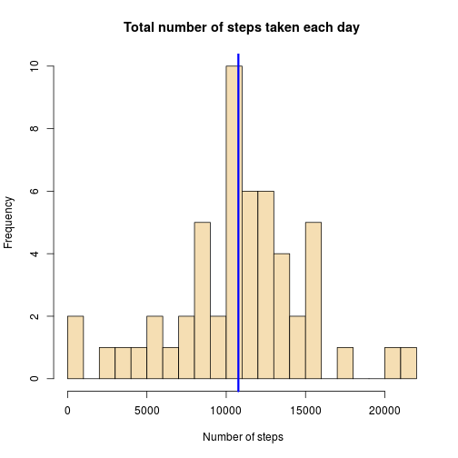
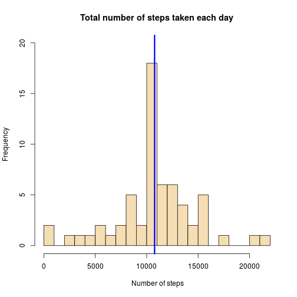
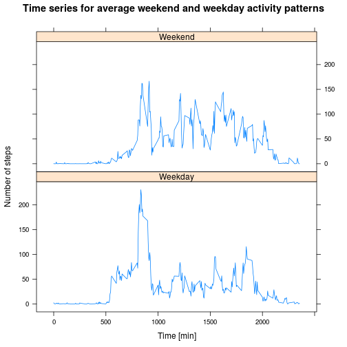

Introduction
-----
It is now possible to collect a large amount of data about personal movement using activity monitoring devices.

This assignment makes use of data from a personal activity monitoring device. This device collects data at 5 minute intervals through out the day. The data consists of two months of data from an anonymous individual collected during the months of October and November, 2012 and include the number of steps taken in 5 minute intervals each day.

Data
----
The data for this assignment are stored in the activity.zip file. They can be loaded in this way:

```r
    activity <- read.csv(unz("activity.zip", "activity.csv"))
```

The variables included in this dataset are:

- **steps**: Number of steps taking in a 5-minute interval (missing values are coded as ```
NA```)

- **date**: The date on which the measurement was taken in YYYY-MM-DD format

- **interval**: Identifier for the 5-minute interval in which measurement was taken

The dataset is stored in a comma-separated-value (CSV) file and there are a total of 17,568 observations in this dataset.

What is mean total number of steps taken per day?
-----
With the following code it is possible to calculate the mean and median for the total number of steps taken per day. The first number is the median and the second is the mean


```r
    tot_steps_day <- tapply(activity$steps, activity$date, sum)
    median_steps_day <- median(tot_steps_day, na.rm = T)
    median_steps_day
```

```
## [1] 10765
```

```r
    mean_steps_day <- mean(tot_steps_day, na.rm = T)
    mean_steps_day
```

```
## [1] 10766.19
```

Below you can find the histogram with a blue line indicating the mean (the median is not shown because it would be indistinguishable from the mean).


```r
    hist(tot_steps_day, breaks = 20, col = "wheat", xlab = " Number of steps",
         main = "Total number of steps taken each day")
    abline(v = mean_steps_day, col = "blue", lwd = 3)
```

 

What is the average daily activity pattern?
------
In order to study the average daily pattern one can make a time series plot of the 5-minute interval (x-axis) and the average number of steps taken, averaged across all days (y-axis).


```r
    mean_steps_int <- tapply(activity$steps, activity$interval, mean, na.rm = T)
    plot(names(mean_steps_int), mean_steps_int, type = "l", xlab = "Time [min]",
         ylab = "Number of steps", main = "Time series for average daily activity pattern")
```

 

From the plot is clear that the most number of steps was taken in the the following time interval 8:35 and 8:40 AM. As a matter of fact the 5-minute interval, which on average across all the days in the dataset, contains the maximum number of steps is 


```r
    names(which.max(mean_steps_int))
```

```
## [1] "835"
```

Imputing missing values
-------
In the dataset there are a number of days/intervals where there are missing values (coded as ```NA```). They may introduce bias into some calculations or summaries of the data.


```r
    summary(activity)
```

```
##      steps                date          interval     
##  Min.   :  0.00   2012-10-01:  288   Min.   :   0.0  
##  1st Qu.:  0.00   2012-10-02:  288   1st Qu.: 588.8  
##  Median :  0.00   2012-10-03:  288   Median :1177.5  
##  Mean   : 37.38   2012-10-04:  288   Mean   :1177.5  
##  3rd Qu.: 12.00   2012-10-05:  288   3rd Qu.:1766.2  
##  Max.   :806.00   2012-10-06:  288   Max.   :2355.0  
##  NA's   :2304     (Other)   :15840
```

All the missing values have been substituted using the mean for that day. A new dataset that is equal to the original dataset but with the missing data filled in has been created.


```r
    activityNArm <- activity

    for (i in which(is.na(activity$steps))) {
         j <- which(as.numeric(names(mean_steps_int)) == activity$interval[i])
         activityNArm$steps[i] <- mean_steps_int[[j]]
    }
```

The histogram of the total number of steps taken each day is slightly different respect to the pervious one (for instance the frequency of the mean value is now larger). Moreover the mean and median in this case are exactly the same.


```r
    tot_steps_day_narm<-tapply(activityNArm$steps, activityNArm$date, sum)
    median_steps_day_narm <- median(tot_steps_day_narm)
    median_steps_day_narm
```

```
## [1] 10766.19
```

```r
    mean_steps_day_narm <- mean(tot_steps_day_narm)
    mean_steps_day_narm
```

```
## [1] 10766.19
```

This the histogram with a blue line indicating the mean and the median.


```r
    hist(tot_steps_day_narm, breaks = 20, col = "wheat", xlab = " Number of steps",
         main = "Total number of steps taken each day", ylim = c(0,20))
    abline(v = mean_steps_day_narm, col = "blue", lwd = 3)
```

 

Are there differences in activity patterns between weekdays and weekends?
-------
A new factor variable with two levels – “Weekday” and “Weekend” indicating whether a given date is a weekday or weekend day has been created (*"sabato" is saturday and "domenica" is sunday in Italian*). The dataset is the one with the filled-in missing values.


```r
    activityNArm$weekday <- as.factor(ifelse(weekdays(as.Date(activityNArm$date))
                              %in% c("sabato","domenica"), "Weekend", "Weekday"))
```


This a panel plot containing a time series plot of the 5-minute interval (x-axis) and the average number of steps taken, averaged across all weekday days or weekend days (y-axis).


```r
    library(plyr)
    library(lattice)
    mean_steps_weekdays <- ddply(activityNArm, .(interval, weekday), summarize,
                                 steps = mean(steps))
    xyplot(steps ~ interval | weekday, mean_steps_weekdays, type = "l",
           layout = c(1, 2), ylab = "Number of steps", xlab = "Time [min]",
           main = "Time series for average weekend and weekday activity patterns")
```

 

From the plots there is a marked difference between the weekday and weekend activity patterns. During weekdays there is a lot more activity in the morning and less through out the day. The spike could be a signature for commuting or preparation for work. Instead during the weekends the activity is more uniform, perhaps due to leisure activities of the weekend.
